# Flocon de Koch

## Objectif

Créer une application Windows Forms en C# qui utilise la récursivité pour dessiner le flocon de Koch.

## Qu'est-ce qu'une fractale ?

Une **fractale** est une figure ou une structure géométrique qui peut être divisée en parties, chacune ressemblant à la
structure entière (cette propriété est appelée **auto-similarité**). Les fractales sont souvent générées par des
processus récursifs, où un motif de base est répété à l'infini à des échelles de plus en plus petites.

### Le flocon de Koch

Le **flocon de Koch** est un exemple classique de fractale. Il est construit à partir d'un segment de ligne divisé de
manière répétée selon une règle simple :

1. Prenez un segment de droite.
2. Divisez ce segment en trois parties égales.
3. Remplacez la partie centrale par un triangle équilatéral "pointant vers l'extérieur" (créant ainsi deux nouveaux
   segments) :
   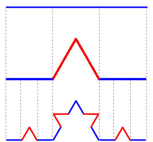
4. Répétez ce processus pour chaque segment de droite nouvellement formé.

## Étapes de réalisation

1. **Créer une nouvelle application Windows Forms :**
    - Ouvrez Visual Studio.
    - Créez un nouveau projet de type **Windows Forms App**.
      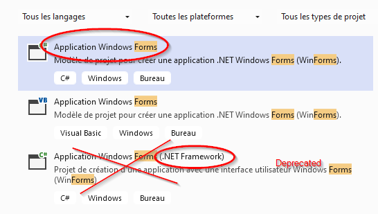
    - Nommez le projet `KochSnowflake`.


2. **Ajouter un `Panel` pour dessiner :**
    - Dans la fenêtre de conception (`Form Designer`), ajoutez un `Panel` à votre formulaire principal (`Form1`).
      Nommez-le `drawingPanel`.
    - Vous utiliserez ce `Panel` pour dessiner le flocon de Koch.
```csharp
namespace KochFractaleFun
{
    public partial class FormBase : Form
    {
        Panel drawingPanel;

        public FormBase()
        {
            InitializeComponent();

            drawingPanel = new Panel();
            drawingPanel.Location = new Point(90, 59);
            drawingPanel.Name = "drawingPanel";
            drawingPanel.Size = new Size(800, 600);
            drawingPanel.TabIndex = 0;
            drawingPanel.Paint += DrawingPanel_Paint;

            this.Controls.Add(drawingPanel);
        }

        private void DrawingPanel_Paint(object sender, PaintEventArgs e)
        {
            using (Pen pen = new Pen(Color.Blue, 1))
            {
                e.Graphics.DrawLine(pen, new Point(50,50), new Point(75,65));
            }
        }
     }
}
```

3. **Créer une fonction récursive pour générer le flocon de Koch selon les informations ci-après**

## Pseudo code

```text
Début

1. Initialiser la fenêtre de dessin (Form)
    - Créer un espace où le flocon de Koch sera dessiné.

2. Définir le niveau de récursivité (niveau)
    - Plus le niveau est élevé, plus la figure sera détaillée.
    - Exemple : niveau = 3 signifie 3 niveaux de divisions.

3. Définir les points initiaux (p1, p2, p3)
    - Ces points forment un triangle équilatéral de départ (de base).
    - p1 et p2 sont les extrémités de la base du triangle.
    - p3 est le sommet du triangle (le point au-dessus de p1 et p2).

4. Pour chaque côté du triangle (3 côtés en tout) :
    - Dessiner la courbe de Koch sur le segment de ce côté.
    - Le processus est le même pour les 3 côtés.

5. Récursivement diviser chaque segment du côté de la courbe :
    - Si le niveau de récursivité est 0 (niveau final) :
        - Dessiner le segment de droite tel quel.
    - Sinon :
        - Diviser le segment en 4 parties :
            1. Première partie : le premier tiers du segment.
            2. Deuxième/Troisième partie : le "pic" formant un triangle équilatéral.
            3. Dernière partie : le dernier tiers du segment.
        - Calculer les nouveaux points de division (`a`, `b`, `c`) pour former le pic du triangle.

6. Répéter le processus pour chaque sous-segment créé (recursion)
    - Appliquer la même logique à chaque nouveau segment jusqu'à ce que le niveau de récursivité atteigne 0.

7. Terminer
    - Lorsque tous les segments sont dessinés, la figure complète du flocon de Koch est affichée.

Fin
```

### Compléments

Pour calculer un troisième point qui forme un triangle équilatéral à partir de deux points donnés `p1` et `p2` dans un
plan 2D, il faut déterminer les coordonnées de ce troisième point `p3`. L'idée est de faire en sorte que le triangle
formé par `p1`, `p2`, et `p3` ait tous ses côtés de même longueur et que l'angle entre chaque côté soit de 60 degrés.

#### Étant donné :

- `p1 = (x1, y1)`
- `p2 = (x2, y2)`

#### Étape 1 : Calculer le vecteur du segment `p1p2`

On veut calculer la différence entre `p2` et `p1` :

- `dx = x2 - x1`
- `dy = y2 - y1`

#### Étape 2 : Calculer le centre du segment `p1p2`

Le milieu du segment entre `p1` et `p2` est donné par :

- `mx = (x1 + x2) / 2`
- `my = (y1 + y2) / 2`

#### Étape 3 : Calculer la hauteur du triangle équilatéral

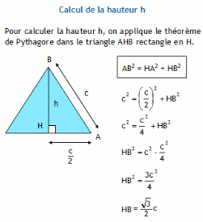

La hauteur `h` d'un triangle équilatéral de côté `d` est donnée par :

- `h = (sqrt(3) / 2) * d`

Ici, la longueur du segment `p1p2` est `d = sqrt(dx^2 + dy^2)`. Donc, la hauteur est :

- `h = (sqrt(3) / 2) * sqrt(dx^2 + dy^2)`

#### Étape 4 : Calculer le troisième point `p3`

Le point `p3` est perpendiculaire au segment `p1p2` à une distance `h` de ce segment, et il y a deux solutions
possibles (le triangle peut être orienté dans deux directions).

1. **Rotation de 60 degrés dans un sens "horaire" :**
    - On utilise une rotation pour calculer les coordonnées de `p3` :
      ```
      x3 = mx - (dy * h / d)
      y3 = my + (dx * h / d)
      ```
    - Cela place `p3` dans une direction perpendiculaire au vecteur `(dx, dy)`.

2. **Rotation de 60 degrés dans le sens "anti-horaire" :**
    - L'autre solution possible pour `p3` est dans la direction opposée :
      ```
      x3 = mx + (dy * h / d)
      y3 = my - (dx * h / d)
      ```

#### Choix de la solution

Le calcul donne deux solutions possibles pour `p3` car un triangle équilatéral peut être construit dans deux
orientations différentes par rapport à la base `p1p2`.

#### Exemple complet en pseudocode

```plaintext
Entrées : 
  p1 = (x1, y1)
  p2 = (x2, y2)

Calculs :
  dx = x2 - x1
  dy = y2 - y1

  d = sqrt(dx^2 + dy^2)       // Longueur du segment p1p2
  h = (sqrt(3) / 2) * d       // Hauteur du triangle équilatéral

  mx = (x1 + x2) / 2          // Milieu de p1p2
  my = (y1 + y2) / 2

  // Solution 1 (sens horaire)
  x3 = mx - (dy * h / d)
  y3 = my + (dx * h / d)

  // Solution 2 (sens anti-horaire)
  x3_alt = mx + (dy * h / d)
  y3_alt = my - (dx * h / d)

Sorties :
  p3 = (x3, y3)   // ou bien
  p3_alt = (x3_alt, y3_alt)
```

En résumé :

- Le point `p3` est calculé en effectuant une rotation de 60 degrés autour du segment `p1p2`.
- Vous pouvez choisir l'une ou l'autre des deux solutions possibles (`p3` ou `p3_alt`) en fonction de la direction dans
  laquelle vous souhaitez former le triangle équilatéral.

### Utilisation

Si vous dessinez un flocon de Koch, vous choisirez généralement une orientation cohérente pour tous les segments, mais
pour simplement former un triangle équilatéral, soit `p3` soit `p3_alt` est une solution correcte.

## Exemple de résultat

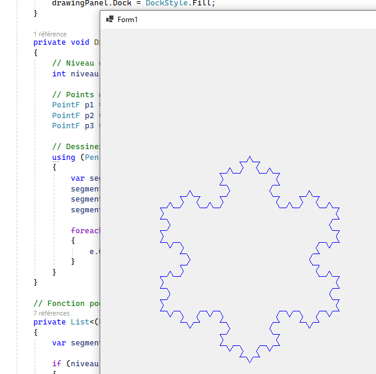

#### Améliorations possibles

1. **Ajouter une interface utilisateur :**
    - Ajoutez un `TrackBar` ou une `NumericUpDown` pour permettre à l'utilisateur de régler dynamiquement le niveau de
      récursivité.

2. **Changer les couleurs en fonction de la profondeur :**
    - Coloriez chaque niveau de récursivité avec une couleur différente pour mieux visualiser les itérations.

3. **Ajouter des boutons pour réinitialiser ou enregistrer l'image :**
    - Ajoutez des boutons pour réinitialiser le dessin ou pour sauvegarder l'image en tant que fichier.

4. ** Dessiner un [arbre fractal](#arbre-fractal) **

## Arbre fractal
L'arbre fractal est une structure qui se dessine de manière récursive en dessinant un tronc qui se divise en deux
branches, puis chaque branche se divise à son tour en deux, et ainsi de suite. Cela forme un arbre avec une structure
auto-similaire.

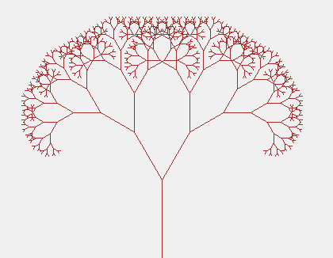

### Étapes pour dessiner l'arbre fractal

1. Commencer par dessiner un tronc vertical.
2. À partir de l'extrémité du tronc, dessiner deux branches plus petites.
3. Répéter ce processus pour chaque nouvelle branche jusqu'à ce qu'une profondeur maximale soit atteinte.

### Pseudocode pour l'arbre fractal

Voici le pseudocode détaillé pour dessiner un arbre fractal :

```plaintext
Fonction DessinerArbre(x, y, longueur, angle, profondeur)
    SI profondeur == 0 ALORS
        RETOURNER                    // Arrêter la récursivité si la profondeur maximale est atteinte
    FIN SI

    // Calculer les coordonnées de l'extrémité de la branche actuelle
    x_fin = x + longueur * cos(angle)
    y_fin = y - longueur * sin(angle) // Moins pour dessiner vers le haut

    // Dessiner la branche actuelle (de x, y à x_fin, y_fin)
    DessinerLigne(x, y, x_fin, y_fin)

    // Réduire la longueur de la branche
    nouvelle_longueur = longueur * facteur_de_réduction

    // Calculer de nouveaux angles pour les branches gauche et droite
    angle_gauche = angle + angle_de_déviation
    angle_droite = angle - angle_de_déviation

    // Appeler récursivement pour dessiner la branche gauche
    DessinerArbre(x_fin, y_fin, nouvelle_longueur, angle_gauche, profondeur - 1)

    // Appeler récursivement pour dessiner la branche droite
    DessinerArbre(x_fin, y_fin, nouvelle_longueur, angle_droite, profondeur - 1)
FIN FONCTION
```

### Paramètres du pseudocode

- **`x, y` :** Coordonnées du point de départ de la branche actuelle.
- **`longueur` :** Longueur de la branche actuelle.
- **`angle` :** Angle de la branche par rapport à la verticale. En général, l'angle est en radians.
- **`profondeur` :** Niveau de récursivité. Si la profondeur atteint 0, la récursion s'arrête.
- **`facteur_de_réduction` :** Coefficient pour réduire la longueur des branches à chaque étape (ex. 0.7 pour réduire la
  longueur de 30 %).
- **`angle_de_déviation` :** Angle de déviation pour les branches gauche et droite (ex. 30 degrés).

### Exemple de base pour démarrer le dessin

Pour dessiner l'arbre fractal, vous commencez avec un tronc vertical à partir d'un point `x, y` donné, une longueur de
tronc initiale, une profondeur maximale, et un angle initial de 90 degrés (pour démarrer avec une branche verticale).

```plaintext
DessinerArbre(x_point_initial, y_point_initial, longueur_initiale, angle_initial = 90 degrés, profondeur_maximale)
```

### Explications des calculs

- **Coordonnées `(x_fin, y_fin)` de la fin de la branche :** Les formules `cos(angle)` et `sin(angle)` sont utilisées
  pour calculer la position de l'extrémité de la branche en fonction de son angle et de sa longueur.
- **`facteur_de_réduction` :** Chaque nouvelle branche est plus petite que la branche précédente pour donner un aspect
  réaliste d'un arbre.
- **Déviation des angles :** Deux nouvelles branches sont créées à chaque nœud, l'une avec un angle `angle_gauche` (par
  ex. `+30 degrés`) et l'autre avec un angle `angle_droite` (par ex. `-30 degrés`).

Cette fractale est assez simple à implémenter et produit une forme intéressante avec des variations basées sur les
angles et la profondeur. Vous pouvez également jouer avec les paramètres comme le facteur de réduction et l'angle de
déviation pour créer des arbres plus denses ou plus fins...

## Généralisation

Vous êtes prêts à dessiner quasiment n'importe quelle fractale à base de lignes.

Allons-y étape par étape.

### Préparation: Dessiner une polyline

Créez un nouveau projet selon les mêmes bases que ci-dessus.

Utilisez le code qui sui pour obtenir le résultat ci-dessous:

```csharp
    public partial class Fractales : Form
    {
        private readonly int PANEL_WIDTH;
        private readonly int PANEL_HEIGHT;

        Graphics graphics;

        // The first point of a pattern must always be (0,0)
        Point[] pattern = new Point[4] { 
            new Point(0, 0), 
            new Point(10, 100), 
            new Point(100, 10), 
            new Point(200, 50) 
        };

        Pen pen = new Pen(Color.Red,3);


        public Fractales()
        {
            InitializeComponent();
            graphics = drawingPanel.CreateGraphics();
            
            // Initialize pannel dimensions
            PANEL_WIDTH = drawingPanel.ClientSize.Width;        
            PANEL_HEIGHT = drawingPanel.ClientSize.Height;
        }

        private void drawingPanel_Paint(object sender, PaintEventArgs e)
        {
            graphics.DrawLines(pen, pattern);
        }
    }
```
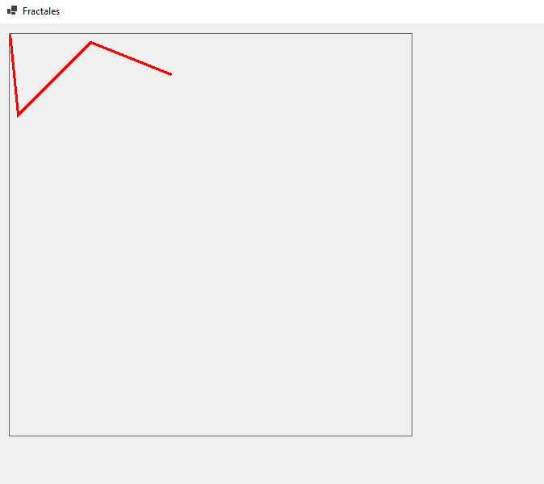

### Etape 1: Coordonnées naturelles

Il est beaucoup plus naturel d'avoir un système de coordonnées dont l'origine est en bas de l'écran.

Ecrivez une méthode privée 

```csharp
        private Point[] VerticalFlip(Point[] points)
```
telle que lorsqu'on fait
```csharp
        graphics.DrawLines(pen, VerticalFlip(pattern));
```
on obtient:

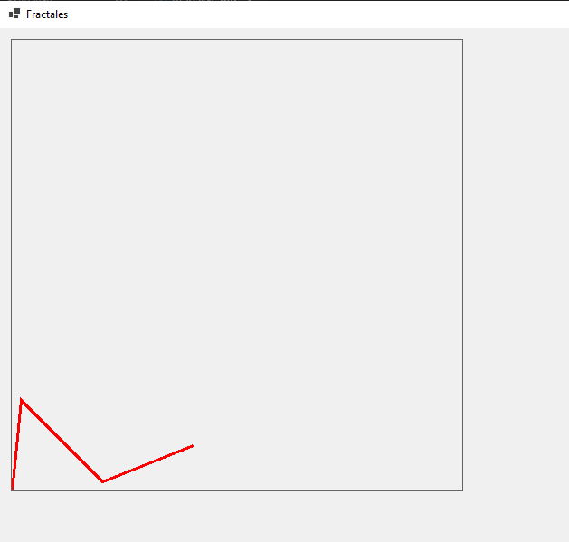

C'est cette ligne brisée - notre pattern - que vous allons fractaliser en remplaçant récursivement chacun des segments par notre pattern!

### Etape 2: Dessiner n'importe où

On veut maintenant pouvoir placer notre ligne n'importe où dans le panel.  
On va donc la déplacer (translate)

Ecrivez une méthode privée 

```csharp
        private Point[] MoveTo(Point[] points, Point basePoint)
```

telle que quand on fait :

```csharp
        graphics.DrawLines(pen, VerticalFlip(MoveTo(pattern, new Point (200,340))));
        graphics.DrawLines(pen, VerticalFlip(MoveTo(pattern, new Point (20,110))));
```

on obtient:

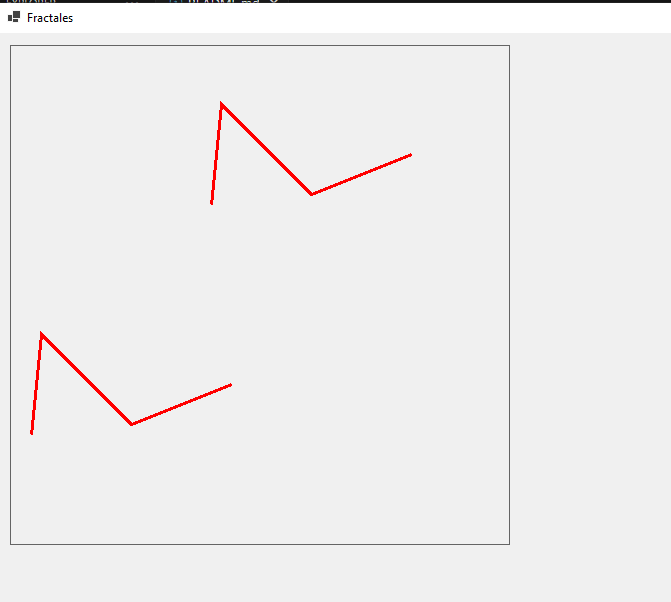

### Etape 3: Redimensionner

On veut pouvoir changer la taille de notre pattern.

Ecrivez une méthode privée 

```csharp
        private Point[] Resize(Point[] points, double factor)
```

telle que quand on fait :

```csharp
graphics.DrawLines(pen, VerticalFlip(MoveTo(Resize(pattern,0.3), new Point (200,340))));
graphics.DrawLines(pen, VerticalFlip(MoveTo(Resize(pattern,1.5), new Point (20,110))));
```

on obtient:

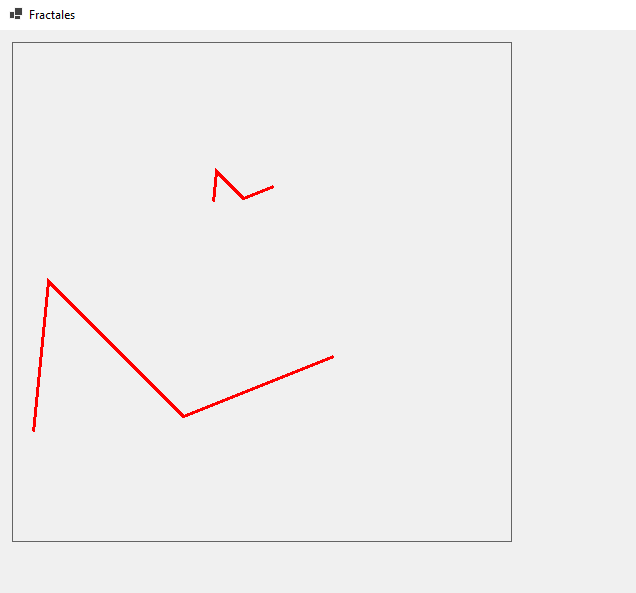


### Etape 4: Orienter

On veut pouvoir changer l'orientation de notre pattern en faisant tourner chaque point d'un certain angle 

Ecrivez une méthode privée 

```csharp
        private Point[] Rotate(Point[] points, int angle)
```

telle que quand on fait :

```csharp
for (int angle = 0; angle < 360; angle+=20)
{
    graphics.DrawLines(pen, 
        VerticalFlip(MoveTo(Resize(Rotate(pattern,angle),0.3), new Point (200,340)))
    );
}
```

on obtient:

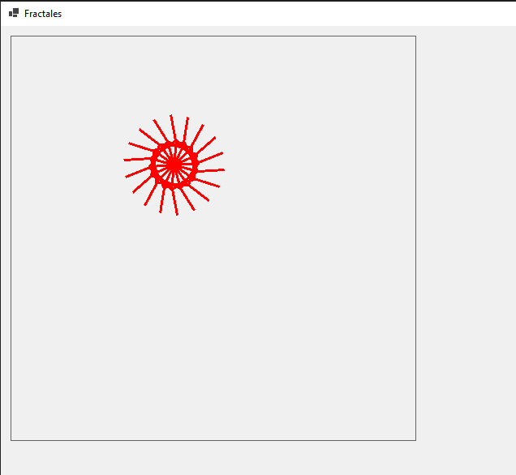

### Etape 5: Le segment représentatif

Lorsqu'on voudra "fractaliser" notre pattern, on devra remplacer chacun de se segments par le pattern lui-même. On se pose alors la question "comment faire correspondre une ligne brisée avec un segment ? La réponse est : grâce au segment représentatif.

Pour faire simple, on va prendre comme segment représentatif de notre pattern le segment qui relie son premier et son dernier point.


On voit que ce dernier est également caractérisé par sa longueur et l'angle qu'il forme avec la verticale.

Nous allons avoir besoin de calculer ces deux valeurs.

Ecrivez deux méthodes

```csharp
    // Returns the angle in degrees of vector p1-p2 with a vertical line
    public int Angle(Point p1, Point p2);
    public double Length(Point p1, Point p2);
```

Vérifiez-les grâce au test unitaire suivant:

```csharp
[TestMethod]
public void Test_angle_and_length()
{
    // Arrange
    Point[] points = new Point[9] {
        new Point(0, 0),
        new Point(10, 100),
        new Point(100, 10),
        new Point(100,-10),
        new Point(10, -100),
        new Point(-10, -100),
        new Point(-100, -10),
        new Point(-100, 10),
        new Point(-10, 100)
    };
    Fractales fractales = new Fractales();

    // Act & Assert
    Assert.AreEqual(6,fractales.Angle(points[0], points[1]));
    Assert.AreEqual(84,fractales.Angle(points[0], points[2]));
    Assert.AreEqual(96,fractales.Angle(points[0], points[3]));
    Assert.AreEqual(174,fractales.Angle(points[0], points[4]));
    Assert.AreEqual(-174,fractales.Angle(points[0], points[5]));
    Assert.AreEqual(-96,fractales.Angle(points[0], points[6]));
    Assert.AreEqual(-84,fractales.Angle(points[0], points[7]));
    Assert.AreEqual(-6,fractales.Angle(points[0], points[8]));

    Assert.AreEqual(100.5, Math.Round(fractales.Length(points[0], points[1]),2));
    Assert.AreEqual(100.5, Math.Round(fractales.Length(points[0], points[2]),2));
    Assert.AreEqual(100.5, Math.Round(fractales.Length(points[0], points[3]),2));
    Assert.AreEqual(100.5, Math.Round(fractales.Length(points[0], points[4]),2));
    Assert.AreEqual(100.5, Math.Round(fractales.Length(points[0], points[5]),2));
    Assert.AreEqual(100.5, Math.Round(fractales.Length(points[0], points[6]),2));
    Assert.AreEqual(100.5, Math.Round(fractales.Length(points[0], points[7]),2));
    Assert.AreEqual(100.5, Math.Round(fractales.Length(points[0], points[8]),2));
}

```

### Etape 6: Substituer le pattern à un segment

Avec le calcul des angles, de la longueur et les méthode de rotation et redimensionnement, nous sommes armés pour l'étape suivante: positionner le segment représentatif du pattern sur n'importe quel segment.


Cela se fait en trois étapes:

1. Rotation   
     
   On sait faire, mais attention à bien calculer l'angle!
2. Redimensionnement  
     
   On sait faire aussi !
3. Positionnement  
     

En code, cela se traduit par le code suivant (à compléter)

```csharp
private Point[] FitPattern(Point[] pattern, Point start, Point end)
{
    // Compute the size ratio

    // Compute the angle

    // Do the job
    return MoveTo(Resize(Rotate(pattern, angle), ratio), start);
}
```

Utilisé ainsi:

```csharp
graphics.DrawLines(pen, VerticalFlip(FitPattern(pattern, new Point(40, 40), new Point(400, 40))));
graphics.DrawLines(pen, VerticalFlip(FitPattern(pattern, new Point(400, 400), new Point(300, 300))));
graphics.DrawLines(pen, VerticalFlip(FitPattern(pattern, new Point(20, 400), new Point(250, 300))));
```

cela donne:


### Etape 7: "Y'a plus qu'à..."

Et voilà, on arrive au moment crucial avec tous les outils en mains.

La "fractalisation" d'une liste de points avec notre pattern se résume à :

1. Si le niveau de fractalisation (`depth`) est de 0 on stoppe la récursion en retournant la liste de points fournie sans modification
2. Sinon, on retoure la liste des points constituée par tous les segments de la ligne donnée dans laquelle on a substitué chaque segment par le pattern

Avec une profondeur de 9:

```csharp
graphics.DrawLines(pen, 
    VerticalFlip(MoveTo(
      Fractalize(pattern, 9),
    new Point(PANEL_WIDTH/3,PANEL_HEIGHT/3))));
```

on obtient:

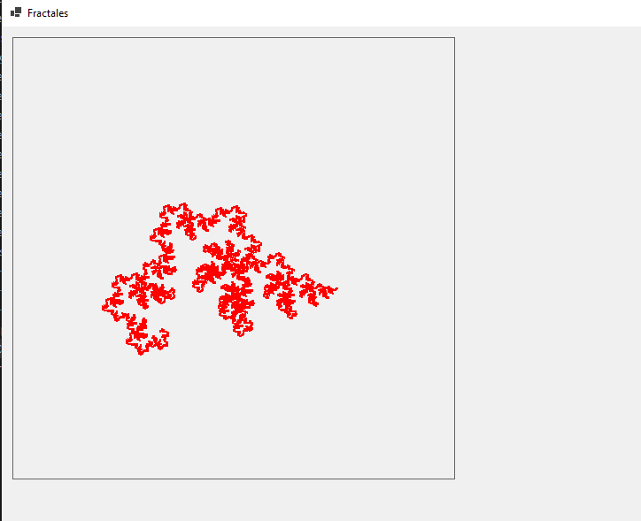

ou en appliquant le même pattern avec une profondeur de 7 à la liste des points utilisés dans les tests unitaires:

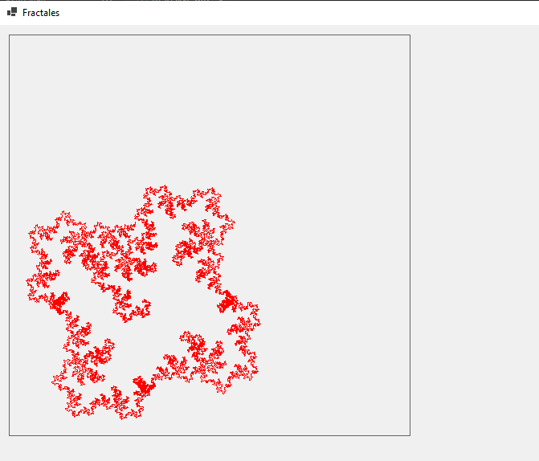

