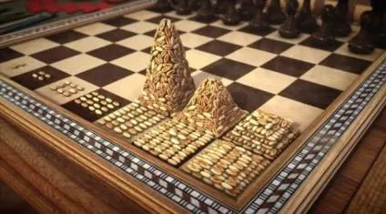
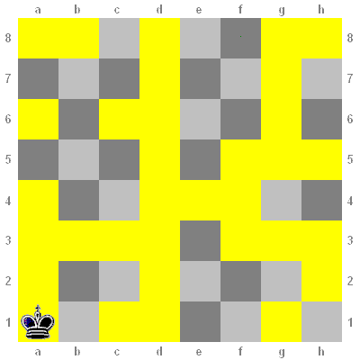

# La route de la soie

(non, on ne va pas aller sur le darknet)

Vous connaissez probablement la légende de l'échiquier et des grains de riz.  
  

Cliquez ici si vous l'avez oubliée

En Inde, le roi Belkib (ou Bathait), qui s'ennuie à la cour, demande qu'on lui invente un jeu pour le distraire. Le sage Sissa invente alors un jeu d'échecs, ce qui ravit le roi. Pour remercier Sissa, le roi lui demande de choisir sa récompense, aussi fastueuse qu'elle puisse être. Sissa choisit de demander au roi de prendre le plateau du jeu et, sur la première case, poser un grain de riz, ensuite deux sur la deuxième, puis quatre sur la troisième, et ainsi de suite, en doublant à chaque fois le nombre de grains de riz que l’on met. Le roi et la cour sont amusés par la modestie de cette demande. Mais lorsqu'on la met en œuvre, on s'aperçoit qu'il n'y a pas assez de grains de riz dans tout le royaume pour la satisfaire2,3.

Si l'on se base sur la production annuelle de riz (479 millions de tonnes de riz usiné en 2014 ), il faudrait un peu moins de 1 500 ans pour réunir tous les grains de riz nécessaires à la réalisation de ce problème (à raison de 0,04 g par grain de riz). Mais si l'on considère le temps de conservation du riz qui est d'un peu plus de 30 ans, il serait en réalité impossible de fournir le riz nécessaire à ce problème, à moins d'augmenter la production de riz d'au moins 5 100 %, soit de multiplier la production par 52.  
_(source: [wikipedia](https://fr.wikipedia.org/wiki/Probl%C3%A8me_de_l%27%C3%A9chiquier_de_Sissa))_

&nbsp;

Si Sissa avait connu la programmation d'aujourd'hui, il aurait certainement adoré la récursivité et il aurait peut-être demandé ceci:

- Recouvrez de soie la moitié des cases de l'échiquier en les choisissant au hasard, mais en vous assurant que A1 et H8 sont couvertes.
- Placez la le roi noir en A1  

- Donnez-moi un programme qui 
  1. Détermine s'il est possible d'arriver en H8 en ne passant que sur de la soie
  1. Montre un chemin si c'est possible

Le coeur de ce programme - la logique qui répond à la question et détermine le chemin - ne fait pas plus de 10 lignes de code.

Et pour que vous puissiez vous concentrer sur ce coeur, vous pouvez vous aider de [ce squelette](silkroadBase.zip) pour démarrer.

### S'il vous reste du temps

- Augmentez la taille de l'échiquier ( cela devrait pouvoir se faire en ne changeant qu'une constante )
- Créez des variantes pour d'autre pièces (tour, fou, reine, cavalier)