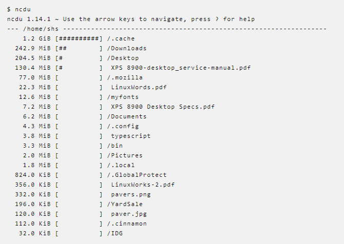

# Travail planifié, semaine #35

- Se dire bonjour / Faire connaissance (si nécessaire)
- Voir les [objectifs du module](https://www.modulbaukasten.ch/module/323/1/fr-FR?title=Programmer-de-mani%C3%A8re-fonctionnelle)
- Voir le [chemin](https://roadmap.sh/r/embed?id=66b88565b64402e0526d8ebc) vers ces objectifs
- Voir [les modalités d'évaluation](../evaluation/DEP.md)

## Mode opératoire
- [Git workflow](../USEME.md)

## Paradigmes
- [Slides (kahoot)](https://create.kahoot.it/share/ict-323-paradigme/ed5b81f2-c5be-4aa4-9e50-acdbbe368c86)
- [Théorie](../supports/source/01-paradigmes.md)

## Théorie

- Découverte de la syntaxe requête de LinQ au moyen de la cheatsheet, entre les étapes 1 et 2 de l'exercice pratique
  
## Pratique

### Exercice place du marché
- Exercice [Place du marché](../exos/marché/enoncé.md) pour:
  - Se remettre le C# dans la tête
  - Se remettre les outils dans les doigts (Visual Studio, Git)
  - Découvrir LinQ
  - (re)voir de bonnes pratiques de développeur

### Exercice NCDU

#### Version 1
  - Sans utiliser LINQ
  - Créer un programme similaire à [ncdu](https://dev.yorhel.nl/ncdu) pour afficher des statistiques sur l’utilisation d’un répertoire/disque sur windows
  
  - Attention à afficher les informations de taille de manière intelligente (kb,mb,gb,...)

#### Version 2
  - En s’inspirant de la [doc suivante](https://learn.microsoft.com/en-us/dotnet/csharp/linq/how-to-query-files-and-directories)
  - Adapter le programme précédent afin de le rendre plus concis
