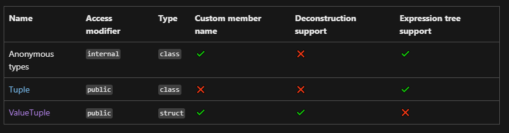
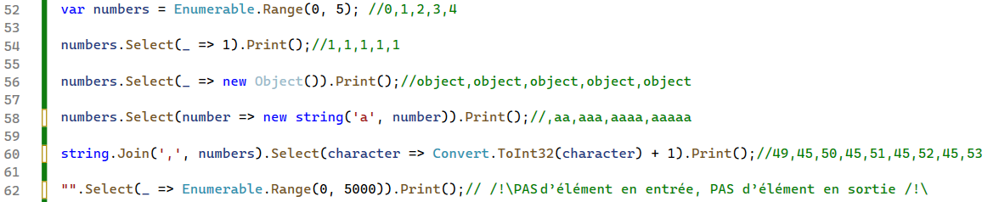
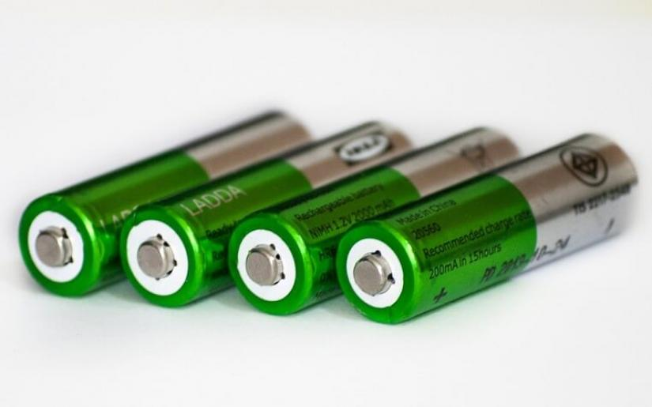

# Transformeur et accumulateur aka `Map` et `Reduce`


Après `Filter` incarné par le `Where` de *Linq* qui permet de filtrer une collection, il est temps d'observer de près deux autres fonctions d'ordre supérieur que sont `Select` (aka map, transformeur ou projection) et `Aggregate` (aka reduce, accumulateur).

## Transformeur | Map | Select | Projection
Inspiré du mots clé SQL de la projection ensembliste `SELECT`, LINQ propose l'outil `Select` pour faire des opérations de *mapping* dans une collection...

### Je ne veux pas transformer, je veux juste *sélectionner*
Le terme `transformer` peut semblé inadapté comparé à celui de `projection`, pourtant en sélectionnant une sous-partie d’un ensemble de départ, il y a une transformation...

> Selon les langages et librairies, il existe une nuance importante entre transformation et projection dans le sens où la transformation s’applique sur la source directement plutôt que de renvoyer une nouvelle structure de données.
> 
> Cet aspect touche à `l'immutabilité` qui sera présentée ultérieurement....

### `Select`: Choix d'un attribut dans une classe

```csharp
class Person{
    public string Name{get;set;} 
    public int Age{get;set;}
    public int Sisters{get;set;}
    public int Brothers{get;set;}
  }

List<Person> cid5d = new List<Person>(){
    new Person(){Name="Paul",Age=15,Sisters=2,Brothers=1},
    new Person(){Name="Lucie",Age=18,Sisters=1,Brothers=3},
    new Person(){Name="Claude",Age=16,Sisters=0,Brothers=0}
};

IEnumerable<string> names = cid5d.Select(person => person.Name);//{"Paul","Lucie","Claude"}
```

Comme en SQL, on sélectionne une partie des données (ici juste le nom) pour générer une nouvelle liste contenant ceux-ci.

### `Select`: Modification d'une valeur

Au moment de produire le résultat, on veut parfois le transformer plutôt que de conserver la valeur brute:
```csharp
IEnumerable<int> numberOfSiblings = cid5d.Select(person => person.Sisters+person.Brothers);//{3,4,0}
```

Cette foi-ci, on génère un nouvel ensemble de valeurs modifiées selon l'ensemble de base...

### Tuple et classe anonyme

#### Tuple
Pour récupérer un sous-ensemble d'attributs d'une classe, le tuple peut s'avérer utile:

```csharp
var adults = 
    cid5d.Select(person => (person.Name/*Devient Item1*/,person.Age/*Devient Item2*/))
        .Where(tuple=>tuple.Item2>=18); //Item2 correspond à l'age
    
    Console.WriteLine(adults.First().Item1); //Lucie
```

> Le `Tuple` ressemble à une classe anonyme pouvant supporter n attributs *readonly* qu'on accède avec les propriétés Item1, Item2, Item3, ItemN un peu comme avec un tableau...

```csharp
var tuple = (1,2,3);
Console.WriteLine(tuple.Item1);//1
Console.WriteLine(tuple.Item2);//2
Console.WriteLine(tuple.Item3);//3
```

> Il est possible de nommer les attributs d'un tuple
```csharp
var tuple = (first: 1, second: 2,third: 3);
Console.WriteLine(tuple.first);//1
Console.WriteLine(tuple.second);//2
Console.WriteLine(tuple.third);//3
```

> ATTENTION toutefois car un `ToList()` fera disparaître cette information...

#### Classe anonyme
À défaut du tuple, il est aussi possible de générer une classe anonyme qui gardera ses informations sur toute la chaîne d’appel LINQ:

```csharp
var anon = new {first= 1, second= 2,third= 3};
Console.WriteLine(anon.first);//1
Console.WriteLine(anon.second);//2
Console.WriteLine(anon.third);//3
```

#### En détail
Pour plus de détail, consulter [la documentation officielle](https://learn.microsoft.com/en-us/dotnet/standard/base-types/choosing-between-anonymous-and-tuple)



### Transformeurs communs
LINQ propose quelques transformeurs utiles:

- `GroupBy`
- `ToList`
- `ToArray`
- `ToDictionary`
  

#### GroupBy
Comme son nom l'indique, il groupe selon un critère et renvoie un dictionnaire dont chaque entrée a:
- Une clé
- La collection des élément ses éléments qui satisfont le critère (sur laquelle on va pouvoir appliquer des aggrégateurs tels que `Count`, `Sum`, `Max`, `Min`, ....)

Voir l'exemple dans la [documentation .NET](https://learn.microsoft.com/fr-fr/dotnet/api/system.linq.enumerable.groupby?view=net-8.0)

#### ToList
Convertit l'entrée (de type `IEnumerable`) en liste (de type `List<T>`).

#### ToDictionary
Crée un dictionnaire selon la fonction d'affectation pour la clé et la valeur.

Cela peut s'avérer utile dans certaines situations, par exemple pour retrouver plus rapidement une information. En effet, retrouver une personne par index dans un dictionnaire comme ceci:

```csharp
Dictionary<int, Person> dico;
Person toto = dico[712]
```
est beaucoup plus rapide qu'une recherche LinQ comme cela

```csharp
List<Person> people;
Person toto = people.Where(p => p.Id == 712).First();
```
Si vous en doutez, essayez [ceci](../../assets/SearchSpeed/)...

Il est temps d'aborder maintenant les accumulateurs...


### Exemple étranges



## Accumulateur | Aggrégateur | Reduce



Cet aspect a déjà été aperçu avec les fonctions `Sum` et `Average` utilisées pour [l'exercice Epsilon](../../exos/filter1/README.md#partie-2-epsilon).

Voici un exemple basique pour calculer une somme et une moyenne:

```csharp
List<int> numbers = new(){1,2,3,4,5};
int sum = numbers.Sum(); // 15
double average = numbers.Average(); // 3.0
```

> Ces 2 fonctions effectuent une opération qui "aplatit" la liste en la **réduisant** (d'où le terme `Reduce`) à une seule valeur.

À cela s'ajoutent deux autres fonctions bien pratiques, `Min` et `Max`:

```csharp
int max = numbers.Max(); // 5
int min = numbers.Min(); // 1
```

### Où est la programmation fonctionnelle ici ?
Jusque là, on a l'impression d'avoir à faire à des fonctions standards, on va donc étudier un nouveau cas pour lequel on comprend bien l'intérêt d'avoir des fonctions de réduction d'ordre supérieur:

```csharp
class Person{
    public string Name{get;set;} 
    public int Age{get;set;}
    public int Sisters{get;set;}
    public int Brothers{get;set;}
  }

List<Person> cid5d = new List<Person>(){
    new Person(){Name="Paul",Age=15,Sisters=2,Brothers=1},
    new Person(){Name="Lucie",Age=18,Sisters=1,Brothers=3},
    new Person(){Name="Claude",Age=16,Sisters=0,Brothers=0}
};

double averageAge = cid5d.Average(person=>person.Age);
double averageSiblings = cid5d.Average(person=>person.Sisters + person.Brothers);

int minAge = cid5d.Min(person=>person.Age);
```

### Aggrégateur générique
Outre les accumulateurs particuliers fournis par *LINQ*, il existe une fonction d'ordre supérieur générique pour la réduction nommée `Aggregate` dont voici un premier exemple:

```csharp
int sum = numbers.Aggregate((current,next)=>current+next)
```

Chaque élément est comparé à celui d'après et en résulte un seul élément défini par le lambda.
Ainsi, à la fin de l'opération, *il ne doit en rester qu'un*...


### Réécriture de `Min`
Avec l'accumulateur générique `Aggregate`, on peut réécrire le `Min` ainsi:

```csharp
int min = numbers.Aggregate((a,b)=>Convert.ToInt32(Math.Min(a,b))); //1
```

Et ainsi de suite pour les autres opérateurs.

### Aggrégateurs avec classes
Pour des types non primitifs, on doit utiliser une signature plus complète avec 3 éléments:

- Seed (valeur de départ à comparer avec le 1er élément)
- Fonction d'aggrégation
- Choix de la forme du résultat

```csharp
var min = cid5d.Aggregate(
    new Person(){Brothers=99}, //Seed
    (a,b)=>a.Brothers<b.Brothers?a:b, //Min logic
    person=>person.Name); //Result transformer
```

#### Que vaut min ?
- 0
- Paul
- Claude
- 1
- ...

La fonction d'aggrégation sélectionne la personne avec le moins de frères et la forme du résultat est demandée sous forme du nom de la personne.

Le résultat est donc:

<details>
<summary>Cliquer ici pour voir/vérifier la réponse</summary>
Claude
</details>