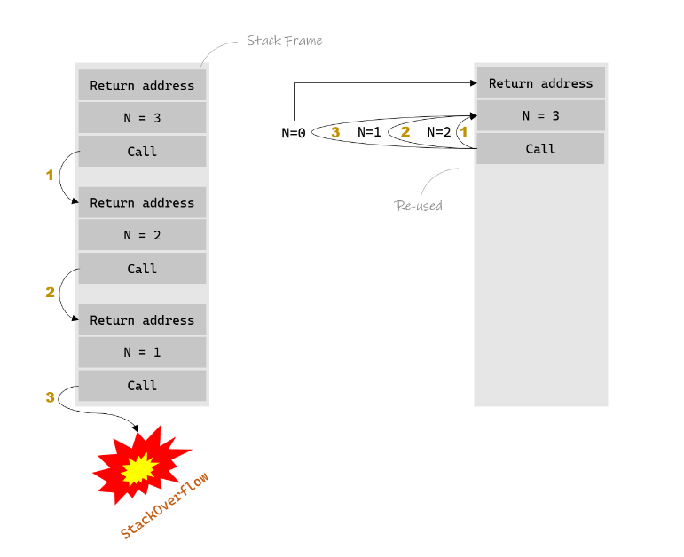
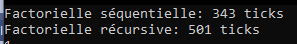

# Pureté, immutabilité et récursivité


Voici 3 termes en lien avec la programmation fonctionnelle qu’il s’agit de démystifier...

## Pureté

Une **fonction pure** est un concept clé en programmation fonctionnelle. Il est simple à énoncer, mais peut s'avérer difficile à appliquer.

**Définition**

>Une fonction pure est une fonction qui, pour des mêmes arguments en entrée, renverra toujours le même résultat, sans provoquer d'effets secondaires.

Ses caractéristiques sont donc:

- La prévisibilité : Une fonction pure se comporte comme une "boîte noire" mathématique. Chaque fois qu'on lui passe les mêmes valeurs, on obtient toujours le même résultat.  
Par exemple, la fonction `x => x * 2` est pure, car si on lui donne 3 en entrée, on recevra toujours 6 en sortie.

- L'absence d'effets secondaires : Une fonction pure ne modifie rien en dehors d'elle-même. Cela signifie qu'elle ne change pas de variables globales, n'écrit pas dans des fichiers ou des bases de données, ni ne modifie les objets en dehors de son propre contexte.

- L'indépendance : Le résultat que retourne une fonction pure ne dépend que des arguments qui lui sont passés. Elle ne va pas rechercher de données externes (fichiers, réseau, variable globale, ...) et elle ne fait pas appel à une fonction impure.


Les fonctions pures sont importantes car elles facilitent le débogage et les tests : il suffit de vérifier l'entrée et la sortie, sans se soucier des changements cachés. De plus, elles permettent d'écrire un code plus sûr et prévisible, car les développeurs peuvent être certains que l'exécution de ces fonctions n'affectera pas d'autres parties du programme.

### Cas concret : le cache
Si une fonction est pure, cela veut dire qu’avec le même *input*, elle donne toujours le même *output*.

Ainsi, on peut facilement implémenter un **cache automatique** comme en python avec l’annotation `@cache`:
```python
@cache
def factorial(n):
    return n * factorial(n-1) if n else 1
```

Pour le csharp [voici un projet intéressant](https://github.com/federico-paolillo/memoize)

## Immutabilité

Tout aussi simple à énoncer, mais pas si simple à mettre en oeuvre, l'immutabilité se définit ainsi:

> Une fois qu'une donnée (variable, objet, tableau, etc.) est créée, elle ne peut plus être modifiée.

Une variable, un objet ou une structure de données immuable est "figée" dès sa création. Si on souhaite réaliser des opérations ou transformations sur cette donnée, on crée une nouvelle donnée avec la valeur souhaitée.  
Par exemple, si une variable `x` vaut 5 et que l'on veut lui ajouter 3, au lieu de modifier `x`, on génère une nouvelle variable `y = x + 3`, tout en laissant `x` intacte.

L'immutabilité rend le code plus sûr et prévisible, car on sait qu'une donnée, une fois définie, ne changera pas au cours de l'exécution. Cela permet de réduire les erreurs liées à des modifications inattendues des variables ou des objets.

Attention: dans certaines situations, on peut croire à tort que l'on applique l'immutabilité:

```csharp
static class ImmutableIntList
{
    static readonly List<int> items = new List<int>();

    public static void Add(int x) { items.Add(x); }

    public static void Dump() { items.ForEach(i => Console.WriteLine(i)); }

    public static void Reset() { items.Clear(); }
}
```
Ce code autorise de modifier le contenu de la liste:
```csharp
items.Add(1);
items.Add(2);
items.Add(3);
```
Ce qui est immutable, c'est l'adresse de la liste en mémoire. Il n'est donc pas possible de faire:
```csharp
items = new List<int>();
```

### Parallèlisation
L’immutabilité est une aussi un moyen de *rendre obsolète* les mécanismes de `Lock` dans un cadre *multi-thread* et ainsi éviter les `deadlock` qui peuvent paralyser tout un système de par leur nature non mutable...

Cet aspect ne sera pas plus détaillé pour l’instant mais il est important de savoir qu’en tant que développeur le choix est offert de créer des espaces mémoires `mutables` et `non mutables`.

À titre d’exemple, [Rust](https://www.rust-lang.org/),  un langage récent et très populaire (utilisé pour le kernel Linux à la place du C...) a fait le choix que, par défaut, on a une constante... à moins d’ajouter le mot clé `mut` devant pour dire que c’est une variable...

## Récursivité

La récursivité est une technique de programmation où une fonction s'appelle elle-même pour résoudre un problème en le divisant en sous-problèmes plus simples, jusqu'à atteindre une condition d'arrêt. C'est un concept central dans de nombreux algorithmes, notamment dans les structures de données comme les arbres ou pour résoudre des problèmes complexes de manière élégante.

Elle se définit comme ceci:

> Une fonction F peut résoudre un problème P de manière récursive si 
>   - Le problème P est trivial. Dans ce cas la fonction retourne directement une valeur
>   - Le problème P peut être divisé en problèmes simples (P1, P2, P3,...) qui peuvent tous être résolus par la fonction F. Dans ce cas, la fonction retourne le résultat de la résolution de tous les sous-problèmes par elle-même

Il est essentiel que la décomposition en problèmes simples débouche sur un problème trivial, faute de quoi on part dans une boucle infinie.

Exemple classique: le calcul de la factorielle d'un nombre n :

Rappel mathématique:

>`6! = 6 * 5 * 4 * 3 * 2 * 1 = 720`

On peut donc écrire la fonction factorielle ainsi en C#:
```csharp
int Factorielle(int x)
{
    int res = 1;
    for (int i = x; i > 1; i--) res *= i;
    return res;
}
```

En observant le rappel ci-dessus, on voit que l'on peut écrire:

>`6! = 6 * 5!` (puisque `5! = 5 * 4 * 3 * 2 * 1`)

Du coup, comme le calcul de `1!` est trivial, on peut écrire la fonction ainsi:

```csharp
int Factorielle(int x)
{
    if (x==1) return 1;
    return x * Factorielle(x - 1);
}
```

> On remarque que l'expression récursive de la fonction n'utilise, dans cet exemple, que des variables immutables...

### Performances
Historiquement, les fonctions récursives étaient moins performantes à cause du fait qu’un appel de fonction impliquait d’allouer des éléments sur la pile, ce qui n’est plus le cas avec la technologie `Tail Call Optimisation` alias `TCO`:



Un test non exhaustif et sujet à des optimisations `JIT` avec .NET 6 donne les résultats suivants sur des factiorielles entre 200 et 210:



### Cas d’application
La récursivité est particulièrement utile pour les problèmes comme les tris (ex. : quicksort), les arbres binaires, ou les algorithmes de recherche.

